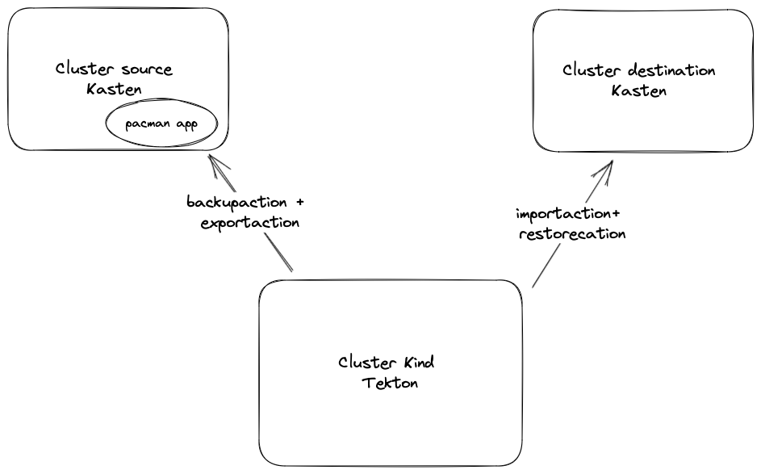
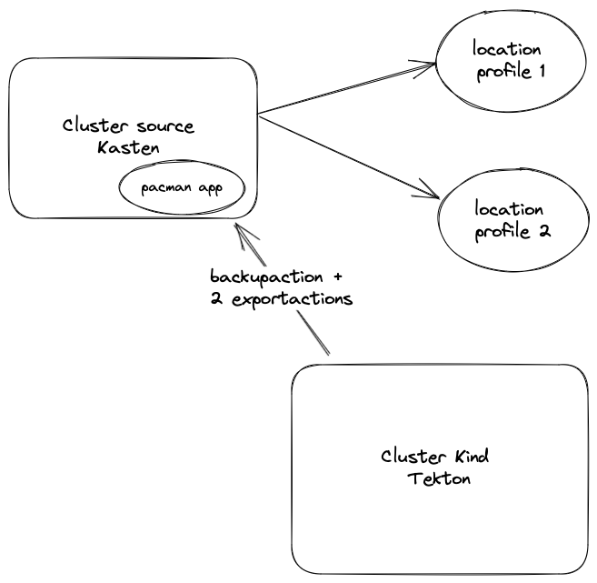

# Kasten Tekton


Kasten-Tekton demonstrates how you can encapsulate Kasten Action and Policy in Tekton Task. 

By organising Kasten Tekton Task in pipeline you can orchestrate complex or repetitive migration scenario.

You can also use Kasten Tekton Task inside your existing Tekton pipeline, for instance you want to backup 
your application before deploying a new version with a lot of potential impact on your data model.

# Disclaimer 

This project is just given as example and is not intended for support, even if you bought Kasten licences.

# The Kasten Tekton Task 

Today we implement 4 Kasten Tekton task 

- BackupAction 
- ExportAction 
- ImportAction
- RestoreAction 

They all have params and result that can consume each other in a pipeline (see the pipeline folder)

# Examples 

3 examples are provided : 
- Migration : backup export import and restore in another cluster
- Ditribute restorepoint : backup and distribute restorepoint in 2 different location profile 
- Backup before deploy : Create a backup of the app before you deploy a new version


## Test the migration pipeline

We suppose you already have 2 clusters that we'll call source and destination and Kasten installed on both of them. 
On the source the pacman application is installed and we're going to migrate it on the destination cluster.

You're going to install Tekton on one of these cluster or spin up a new cluster. We'll demonstrate the latter.





### Spin up a Kind cluster with tekton 

```
git clone git@github.com:tektoncd/plumbing.git
cd plumbing/hack 
# -k for docker without it's podman
./tekton_in_kind.sh -k 
# the script launch port-forward on 9097 hence you can directly
open http://localhost:9097
# otherwise you can execute the port-forward 
# kubectl port-forward service/tekton-dashboard -n tekton-pipelines 9097:9097 
```

### install the Kasten Tekton Tasks and the migration pipeline

```
kubectl create -f tasks/
kubectl create -f pipelines/
```

Create the kubeconfig workspaces for source and destination 

```
kubectl config use-context <source>
./sa-config.sh source-cluster https://<source-api> kasten-io k10-k10 > source-config
kubectl config use-context <destination>
./sa-config.sh destination-cluster https://<destination-api> kasten-io k10-k10 > destination-config
kubectl config use-context kind-tekton
kubectl create secret generic source-config --from-file=kubeconfig=source-config
kubectl create secret generic destination-config --from-file=kubeconfig=destination-config
```

Create the pacman app on source
```
kubectl config use-context <source>
helm repo add pacman https://shuguet.github.io/pacman/
helm repo update
helm install pacman pacman/pacman -n pacman --create-namespace --set service.type=LoadBalancer 
```

check you can access the pacman board and record a game in the high score.


Edit the migration-pipeline-run.yaml file : 
- change the locationprofile-name name with the location profile in the source cluster.
- change the targetstorageclass-name value with the storage class on the destination cluster 

```
kubectl create -f examples/pipeline-run-examples/migration-pipeline-run.yml
```

Check pacman app on the destination, control high score match with the source.

## Test the distribute-restorepoint pipeline

The goal is to send a backup to 2 different location profiles, one backupaction is started 
followed by 2 concurrent exportactions.



Create the tekton kind cluster (as discribed in the migration pipeline) 
or use a cluster where tekton is installed.

Create the app
```
kubectl config use-context <source>
helm repo add pacman https://shuguet.github.io/pacman/
helm repo update
helm install pacman pacman/pacman -n pacman --create-namespace --set service.type=LoadBalancer 
```

Create the source config in the tekton cluster.
```
./sa-config.sh source-cluster https://<source-api> kasten-io k10-k10 > source-config
kubectl config use-context kind-tekton
kubectl create secret generic source-config --from-file=kubeconfig=source-config
```

Edit the distribute-restorepoint-pipeline-run.yaml file : 
- change the locationprofile-name name with the location profile in the source cluster.

```
kubectl create -f examples/pipeline-run-examples/distribute-restorepoint-pipeline-run.yml
```

## Test backup before deploy 

In this pipeline we do the classical CI/CD operaion 
- fetch: we fecth the code source
- build: we build a new socker image from the source
- push: we push the image to a docker registry 
- deploy: we deploy the app with helm on a cluster and we configure helm to use this image 

But between `push` and `deploy` we insert a backup action so that if the anything wrong happen with the new version 
of the app we have a way to revert to the previous version of the application.

### Add git-clone and kaniko task 

- git-clone will fetch the code source
- kaniki will build and push the new image

```
kubectl apply -f https://raw.githubusercontent.com/tektoncd/catalog/main/task/git-clone/0.6/git-clone.yaml
kubectl apply -f https://api.hub.tekton.dev/v1/resource/tekton/task/kaniko/0.6/raw
```

### Prepare git credentials and docker credentials 

Create credential to fetch your git lab repo. First fork the https://github.com/shuguet/pacman repo
then create git secret that will be used as a workspace for the git-clone task
```
kubectl config use-context <source>
cd ~/.ssh
k create secret generic git --from-file=id_rsa=id_rsa --from-file=known_hosts
```

Now create the docker-credentials secret that will be used as a workspace for the kaniko task.
```
kubectl create secret docker-registry docker-credentials \
   --docker-username=<changeme> \
   --docker-password=<changeme> \
   --dry-run=client -o yaml \
   | sed 's/\.dockerconfigjson/config\.json/g' | sed 's/kubernetes\.io\/dockerconfigjson/Opaque/g' | kubectl create -f -
```
note that you need to change `<changeme>` by your own values.

### launch the pipeline 

edit the file `examples/pipeline-run-examples/fetch-build-push-backup-deploy-run.yaml` and 
change the `<changeme>` by your own values then launch the pipeline 
```
kubectl create -f examples/pipeline-run-examples/distribute-restorepoint-pipeline-run.yml
``` 

validate that a new version of pacman is up and running 
```
kubectl get po -n mcourcy-pacman -o yaml | grep pacman: | grep image
      image: docker.io/michaelcourcy/pacman:17d6414e32edeb11c1eb89ed679f774fc3962208
      image: michaelcourcy/pacman:17d6414e32edeb11c1eb89ed679f774fc3962208
```

`17d6414e32edeb11c1eb89ed679f774fc3962208` is the sha value of the last commit 

### Introducea breaking change that erase all the registered score 

In the pacman application insert this code in routes/highscores.js line 57

```
//error ???? why did I write that !!!! 
//ahhhh too late ....
db.collection('highscore').remove()
```

With this breaking changes the next time someone will we create a new highscore all 
the previous scores will be removed. 

```
git add routes/highscores.js
git commit -m "deliberate errors"
git push origin main
```

### redeploy 

Now rebuild and redeploy 
```
kubectl create -f examples/pipeline-run-examples/distribute-restorepoint-pipeline-run.yml
```

Create a new highscore, all the previous highscore has beed removed, that's a loss of data.

### Restore

Fortunately the pipeline include a backupaction, go to the latest restore point in Kasten GUI and 
restore, you should get back your previous high scores.


